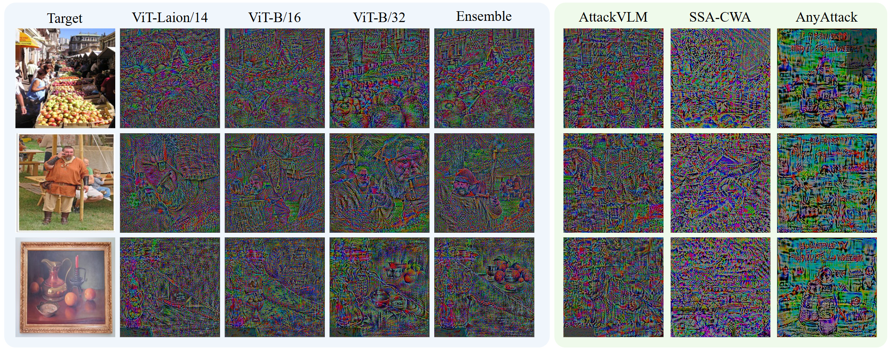
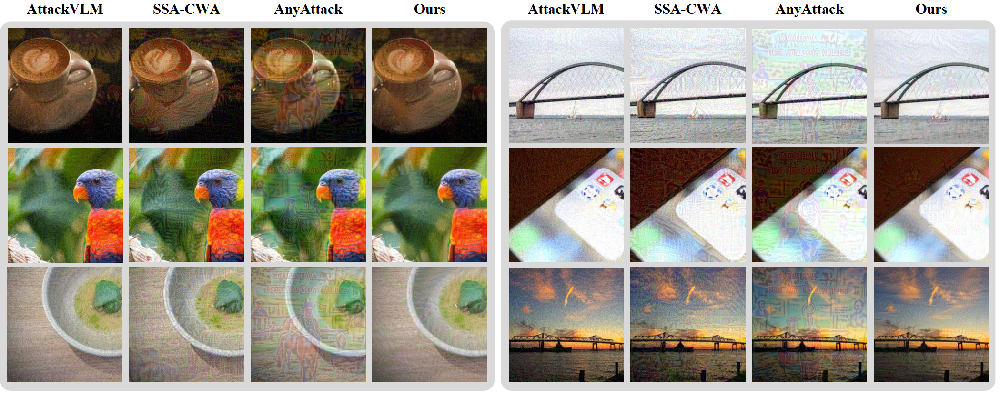

# $M\text{-}Attack$: A Simple Baseline Achieving Over 90% Success Rate Against GPT-4.5/4o/o1

[](https://vila-lab.github.io/M-Attack-Website/)
[](https://huggingface.co/datasets/MBZUAI-LLM/M-Attack_AdvSamples)
<a href="https://arxiv.org/abs/2503.10635"></a>
[](https://x.com/vila_shen_lab)
[](https://github.com/VILA-Lab/M-Attack?tab=MIT-1-ov-file)
[](https://www.python.org/downloads/release/python-3100/)
[](https://github.com/VILA-Lab/M-Attack/issues)

This repository is the official implementation of *A Frustratingly Simple Yet Highly Effective Attack Baseline: Over 90% Success Rate Against the Strong Black-box Models of GPT-4.5/4o/o1*.


> *Illustration of our proposed framework. Our method is based on two components: ***Local-to-Global*** or ***Local-to-Local Matching*** (LM) and ***Model Ensemble*** (ENS). LM is the core of our approach, which helps to refine the local semantics of the perturbation. ENS helps to avoid overly relying on single models embedding similarity, thus improving attack transferability.*

## Requirements

**Dependencies**: To install requirements:

```bash
pip install -r requirements.txt
wandb login
```

or run the follwoing code to install up-to-date libraries

```bash
conda create -n mattack python=3.10
conda activate mattack
pip install hydra-core
pip install salesforce-lavis
pip install -U transformers
pip install gdown
pip install wandb
pip install pytorch-lightning
pip install opencv-python
pip install --upgrade opencv-contrib-python
pip install -q -U google-genai
pip install anthropic
pip install scipy
pip install nltk
pip install timm==1.0.13
pip install openai
python -m spacy download en_core_web_sm
pip install git+https://github.com/openai/CLIP.git

wandb login
```

> Note: you might need to register a [Weight & Bias](https://wandb.ai/) account, then fill `wandb.entity` in `config/ensemble_3models.yaml`

**Images**: We have already included the dataset used in our paper, located in `resources/images`

- `resources/images/bigscale/nips17` for clean images
- `resources/images/target_images/1` for target images
- `resources/images/target_images/1/keywords.json` for labeled semantic keywords

We also provide 1000 images used to scale up for better statistical stability, located in `resources/images/bigscale_1000/` and `resources/images/target_images_1000/`, respectively.

**API Keys**: You need to register API keys for the following APIs for evaluation:

- [OpenAI](https://platform.openai.com/api-keys)
- [Google](https://console.cloud.google.com/apis/api/genai-api.googleapis.com/overview?project=mattack)
- [Anthropic](https://console.anthropic.com/settings/keys)

Then, create `api_keys.yaml` under the root following this template:

```yaml
# API Keys for different models
# DO NOT commit this file to git!

gpt4v: "your_openai_api_key"
claude: "your_anthropic_api_key"
gemini: "your_google_api_key" 
gpt4o: "your_openai_api_key"
```

> Note: DO NOT LEAK YOUR API KEYS!

## Quick Start

```bash
python generate_adversarial_samples.py
python blackbox_text_generation.py -m blackbox.model_name=gpt4o,claude,gemini
python gpt_evaluate.py -m blackbox.model_name=gpt4o,claude,gemini
python keyword_matching_gpt.py -m blackbox.model_name=gpt4o,claude,gemini
```

Then you can find corresponding results in `wandb`. Below is our detailed instructions for each step. We also provide our generated adversarial samples in [Hugging Face](https://huggingface.co/datasets/MBZUAI-LLM/M-Attack_AdvSamples).

## 1. Generate Adversarial Samples

```train
python generate_adversarial_samples.py 
```

The config is managed by [Hydra](https://hydra.cc/). To change the config, either directly changing `config/ensemble_3models.yaml` or use commanline override. For example, to scale up to 1000 image, change `data.cle_data_path` and `data.tgt_data_path` in the config, either directly changing `config/ensemble_3models.yaml` or use commanline override:

```bash
python generate_adversarial_samples.py data.cle_data_path=resources/images/bigscale_1000 data.tgt_data_path=resources/images/target_images_1000
```

It is the same if you want to change $\alpha$ or $\epsilon$:

```bash
python generate_adversarial_samples.py optim.alpha=0.5 optim.epsilon=16
```

## 2. Evaluation

The evaluation is seperated into two parts:

1. generate descriptions for clean and adversarial images on target blackbox commercial model
2. evaluate ***KMRScore*** or *GPTScore*-based ***ASR***

For the first part, run:

```bash
python blackbox_text_generation.py -m blackbox.model_name=gpt4o,claude,gemini {CONFIG IN STEP 1}
```

The line `-m blackbox.model_name=gpt4o,claude,gemini` is used to start [Hydra Multi-Run](https://hydra.cc/docs/tutorials/basic/running_your_app/multi-run/) to automatically run multiple setting for generating descriptions with different blackbox commercial models.

> Note: The `{CONFIG IN STEP 1}` means using the same config as in Step 1. In Step 1 we create a hash of the config and use it as the unique folder name to save the generated images and descriptions. Thus, for Step 2, to evaluate the correct images and descriptions, you need to use the same config.

For the second part, run:

```bash
python gpt_evaluate.py -m blackbox.model_name=gpt4o,claude,gemini {CONFIG IN STEP 1}
```

```bash
python keyword_matching_gpt.py -m blackbox.model_name=gpt4o,claude,gemini {CONFIG IN STEP 1}
```

For imperceptiblity metrics ($l_1$, $l_2$) evaluation, run:

```bash
python evaluation_metrics.py {CONFIG IN STEP 1}
```


## Results

Our model achieves the following performance on the target blackbox commercial models, $\text{KMR}_a$, $\text{KMR}_b$, $\text{KMR}_c$ are the *KMRScore* under threshold 0.25, 0.5, 1.0, respectively. $\text{ASR}$ is the success rate of the attack evaluated by *GPTScore* through a *LLM-as-judge* protocol.

## Results under different $\epsilon$

#### Results on GPT-4o

| $\epsilon$   | $\text{KMR}_a$ | $\text{KMR}_b$ | $\text{KMR}_c$ | $\text{ASR}$  |
|----|------|------|------|------|
| 4  | 0.30 | 0.16 | 0.13 | 0.26 |
| 8  | 0.74 | 0.50 | 0.12 | 0.82 |
| 16 | 0.82 | 0.54 | 0.13 | 0.95 |

#### Results on Claude 3.5 Sonnet

| $\epsilon$   | $\text{KMR}_a$ | $\text{KMR}_b$ | $\text{KMR}_c$ | $\text{ASR}$  |
|----|------|------|------|------|
| 4  | 0.05 | 0.02 | 0.02 | 0.05 |
| 8  | 0.22 | 0.08 | 0.06 | 0.22 |
| 16 | 0.31 | 0.18 | 0.03 | 0.29 |

#### Results on Gemini 2.0-flash

| $\epsilon$   | $\text{KMR}_a$ | $\text{KMR}_b$ | $\text{KMR}_c$ | $\text{ASR}$  |
|----|------|------|------|------|
| 4  | 0.20 | 0.11 | 0.10 | 0.11 |
| 8  | 0.46 | 0.23 | 0.08 | 0.46 |
| 16 | 0.75 | 0.53 | 0.11 | 0.78 |

## Comparsion with Other Methods

We also compare our method with other state-of-the-art methods on the target blackbox commercial models, presented in the following table.


## Visualization

We provide visualization of perturbations and adversarial samples generated by different methods and our $\mathbf{\mathtt{M}}\text{-}\mathbf{\mathtt{Attack}}$.



***



## Citation

```
@article{myrzakhan2024openllmleaderboard,
  title={A Frustratingly Simple Yet Highly Effective Attack Baseline: Over 90% Success Rate Against the Strong Black-box Models of GPT-4.5/4o/o1},
  author={Zhaoyi Li and Xiaohan Zhao and Dong-Dong Wu and Jiacheng Cui and Zhiqiang Shen},
  journal={arXiv preprint arXiv:2503.10635},
  year={2025},
}
```
